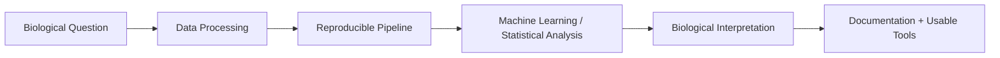

## Hi there 👋
# Hi, I'm Misael Lazaro 👋

### Bioinformatics • Machine Learning • Research Software Engineering

I'm a computational biologist and software-focused researcher who builds reproducible tools for genomics, structural biology, and machine learning. My background combines **biochemistry**, **computer science**, and **high-performance computing**, which allows me to move comfortably between biological questions, scalable data workflows, and production-quality scientific software.

I am currently completing an **M.S. in Computer Science at the University of Illinois Urbana-Champaign** and have prior graduate training in **Biochemistry**. I enjoy building tools that help scientists analyze complex biological data, interpret results, and make research workflows easier to reproduce and scale.

---

## 🔬 What I Work On

I am especially interested in roles where I can contribute to:

- Bioinformatics and computational biology software
- Genomics, transcriptomics, and spatial omics workflows
- Machine learning for biological or healthcare data
- Research software engineering and reproducible scientific computing
- Cloud/HPC-based analysis pipelines

---

## 🧰 Technical Toolkit

**Bioinformatics & Scientific Computing:** NGS analysis, RNA-seq, ChIP-seq, genome assembly, spatial transcriptomics, AlphaFold 2/3, PyMOL, VMD, Nextflow, SLURM, HPC workflows

---

## 🚀 Featured Projects

> Add screenshots, workflow diagrams, plots, or short GIFs under an `assets/` folder and replace the placeholder image links below.

### 1. Single-Cell RNA-seq Benchmarking Replication

Re-implemented and validated comparative single-cell RNA-seq workflows with an emphasis on reproducibility, modular design, and fair method comparison.

**Highlights**
- Built modular workflows for comparing analysis methods
- Focused on reproducibility and validation of published results
- Connected computational outputs back to biological interpretation

**Tech:** `R` `Python` `single-cell RNA-seq` `benchmarking` `reproducible research`

[View Repository](https://github.com/misaell2)

---

### 2. Structural Biology + Protein-Ligand Analysis Workflows

Developed Python-based workflows for structural and functional protein-ligand analysis, including conserved binding residue identification and large-scale experimentation on HPC systems.

**Highlights**
- Used AlphaFold, PyMOL, VMD, and Python-based analysis tools
- Ran and validated compute-intensive workflows on HPC clusters with SLURM
- Improved code maintainability and usability for scientists

**Tech:** `Python` `AlphaFold` `PyMOL` `VMD` `SLURM` `HPC` `structural biology`

---

### 3. Machine Learning for Healthcare / ECG Classification

Built machine learning workflows for biomedical data, including multi-label ECG classification and healthcare-focused model development.

**Highlights**
- Developed task structure for multi-label ECG classification
- Worked with physiological waveform-style data
- Emphasized clean APIs, testing, and documentation

**Tech:** `Python` `PyTorch` `machine learning` `healthcare data` `time series` `testing`

---

### 4. Cloud + ML Data Pipelines

Designed cloud-based data and machine learning workflows using AWS services, with emphasis on scalable processing, automation, monitoring, and reproducible deployment.

**Highlights**
- Built data pipelines using AWS, Docker, and Python
- Worked with ML training/evaluation workflows and cloud orchestration
- Practiced production-oriented design: monitoring, reproducibility, and automation

**Tech:** `AWS` `Docker` `Python` `machine learning` `data engineering` `cloud computing`

---

## 📌 Why Recruiters Should Reach Out

I bring a combination that is especially useful for bioinformatics, computational biology, and scientific software roles:

- **Biology fluency:** I understand the experimental context behind genomics, transcriptomics, structural biology, and molecular biology data.
- **Software engineering mindset:** I care about maintainable code, documentation, testing, and tools that other scientists can actually use.
- **Scalable computing experience:** I have worked with HPC, SLURM, Docker, AWS, and large biological datasets.
- **Communication strength:** I have written tutorials, taught technical concepts, collaborated across disciplines, and presented research clearly.

I am most excited about roles in **bioinformatics**, **computational biology**, **machine learning for biology/healthcare**, and **research software engineering**.

---

## 📊 GitHub Stats

  
  

---

## 🤝 Let's Connect

- GitHub: [github.com/misaell2](https://github.com/misaell2)
- LinkedIn: [linkedin.com/in/misael-lazaro](https://linkedin.com/in/misael-lazaro)
- Email: [lazaromisael95@gmail.com](mailto:lazaromisael95@gmail.com)

---

Thanks for visiting my profile! I am always interested in projects at the intersection of **biology, software, and machine learning**.

<!--
**misaell2/misaell2** is a ✨ _special_ ✨ repository because its `README.md` (this file) appears on your GitHub profile.

Here are some ideas to get you started:

- 🔭 I’m currently working on ...
- 🌱 I’m currently learning ...
- 👯 I’m looking to collaborate on ...
- 🤔 I’m looking for help with ...
- 💬 Ask me about ...
- 📫 How to reach me: ...
- 😄 Pronouns: ...
- ⚡ Fun fact: ...
-->
